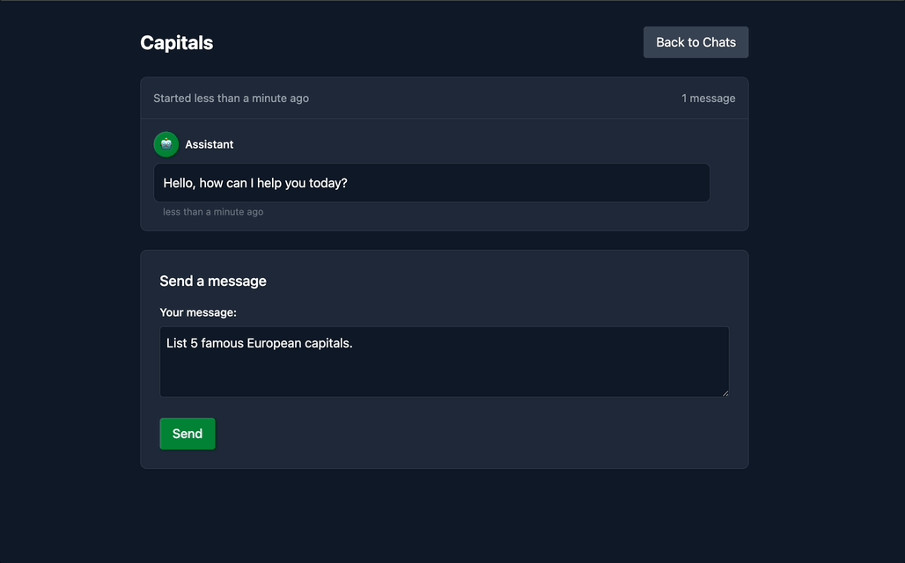

# AI Chat Application

A small, real-time chat application with AI-powered responses using Google's Gemini API. This application enables users to create conversation threads and interact with an advanced AI assistant.




## Features

- **Conversational AI**: Real-time responses from Google's Gemini 2.0 Flash model
- **Multiple Chat Threads**: Create and manage separate conversations
- **Real-time Updates**: Uses Hotwire/Turbo for seamless, app-like experience
- **Loading Indicators**: Visual feedback while the AI generates responses
- **Asynchronous Processing**: Background job processing for AI responses

## Technology Stack

- **Ruby on Rails 8**
- **Hotwire/Turbo+StimulusJS**
- **Tailwind**
- **Google Gemini API**
- **ActiveJob/Sidekiq**
- **Sqlite**

## Getting Started

### Prerequisites

- Ruby 3.x
- Rails 8.x
- Sqlite
- Google API Key (for Gemini API)

### Installation

1. Clone the repository
   ```bash
   git clone https://github.com/yourusername/ai-chat.git
   cd ai-chat
   ```

2. Install dependencies
   ```bash
   bundle install
   ```

3. Set up environment variables
   ```bash
   # Create a .env file and add your Google API key
   echo "GOOGLE_API_KEY=your_api_key_here" > .env
   ```

4. Set up the database
   ```bash
   rails db:create db:migrate
   ```

5. Start the server
   ```bash
   bin/dev
   ```

7. Visit `http://localhost:3000` in your browser

## Customization

### Changing the AI Model

You can modify the AI model in `app/jobs/ai_response_job.rb`:

```ruby
options: {
  model: "gemini-2.0-flash", # Change to a different Gemini model
  ...
}
```
